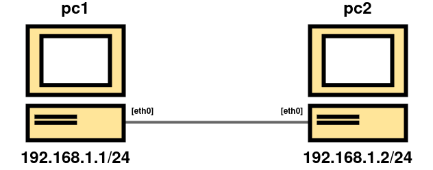

## 1. Obiettivo



Implementare un meccanismo di **traffic shaping classless** usando l'algoritmo **TBF (Token Bucket Filter)**.
Ridurre la banda utilizzabile da pc1 a pc2 e viceversa a **1 Mbit/s**.
#### Parametri TBF:
* `rate` = `1Mbit`
* `burst` = `10k`
* `latency` = `50ms`

---

## 2. Verifica del Funzionamento
#### Creazione file di test
Scegliere uno dei due host su cui creare il file con il comando:

```bash
dd if=/dev/urandom of=file.bin bs=1M count=1
```


#### Verifica del corretto funzionamento di damper
Sul lato del destinatario si può usare il comando seguente:

```bash
nc -l -p 8080 > /dev/null
```

Invece, sul lato mittente, si può usare questo comando:

```bash
time sh -c "cat file.bin | nc <IP_DESTINATARIO> 8080 -q1"
```

---

## 3. Soluzione tramite damper
#### Setup dei nodi su Kathara
Fare riferimento ai file del repository.

#### File damper.conf
Modificare il file **/etc/damper/damper.conf**, per rispettare i parametri dell'esercizio.

```conf
# nfqueue queue id
queue 3

# traffic limit in bits per second (suffixes K and M allowed)
limit 1M

# queue length
packets 7
```

In questo modo avremo un **rate** di 1Mbits/s e un **burst** di 10K (se come **MTU** consideriamo 1500 byte, allora equivale a 7 packets su damper).

#### Iptables
Prima di avviare l'istanza di damper, bisogna creare un regola sulle **iptables**:

```bash
iptables -t raw -A OUTPUT -j NFQUEUE --queue-num 3 --queue-bypass
```

In modo da catturare tutto il traffico in uscita e assegnarlo alla nfequeue numero 3.

#### Istanza damper
Per finire, sarà necessario avviare l'istanza di damper con il comando:

```bash
damper /etc/damper/damper.conf &
```

Per far partire lo shaper.

---


