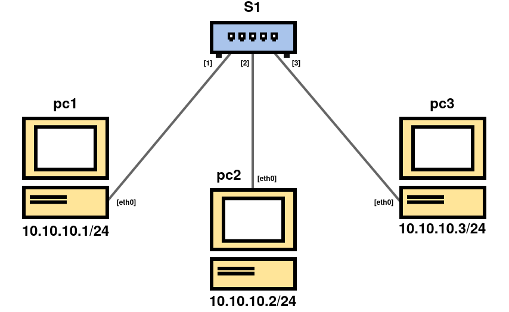

## 1. Obiettivo



Si vogliono applicare discipline di coda opportune per limitare il traffico tra coppie di nodi. 
A tal fine si definiscono le seguenti due modalità di funzionamento della rete:
* **Fast** = `banda >= 50 Mbit/s` o non limitata
* **Slow** = `banda = 1 Mbit/s`

Si vogliono realizzare delle configurazioni del traffic shaping in cui le velocità di trasferimento tra ciascuna possibile coppia di nodi coinvolti sono indicate nelle tabelle.

#### Tabella 1
|    | h1   | h2   | h3   |
| :--- | :---: | :---: | :---: |
| **h1** | –    | Fast | Fast |
| **h2** | Fast | –    | Slow |
| **h3** | Fast | Slow | –    |

#### Tabella 2
|    | h1   | h2   | h3   |
| :--- | :---: | :---: | :---: |
| **h1** | –    | Slow | Slow |
| **h2** | Slow | –    | Fast |
| **h3** | Slow | Fast | –    |

#### Tabella 3
|    | h1   | h2   | h3   |
| :--- | :---: | :---: | :---: |
| **h1** | –    | Fast | Slow |
| **h2** | Fast | –    | Fast |
| **h3** | Slow | Fast | –    |

#### Tabella 4
|    | h1   | h2   | h3   |
| :--- | :---: | :---: | :---: |
| **h1** | –    | Fast | Slow |
| **h2** | Fast | –    | Slow |
| **h3** | Slow | Slow | –    |


---

## 2. Verifica del Funzionamento
#### Creazione file di test
Scegliere uno dei due host su cui creare il file con il comando:

```bash
dd if=/dev/urandom of=file.bin bs=1M count=1
```


#### Verifica del corretto funzionamento di damper
Sul lato del destinatario si può usare il comando seguente:

```bash
nc -l -p 8080 > /dev/null
```

Invece, sul lato mittente, si può usare questo comando:

```bash
time sh -c "cat file.bin | nc <IP_DESTINATARIO> 8080 -q1"
```

---

## 3. Soluzione tramite damper
Prendiamo come esempio il nodo **pc1** nel caso della seconda tabella, il procedimento sarà lo stesso per gli altri nodi.

#### Setup dei nodi su Kathara
Fare riferimento ai file del repository.

#### File damper.conf
Modificare il file **/etc/damper/damper.conf**, per rallentare il traffico verso **pc2**, con la nfequeue numero 3.

```conf
# nfqueue queue id
queue 3

# traffic limit in bits per second (suffixes K and M allowed)
limit 1M

# queue length
packets 100
```

Creare e modificare un nuovo file **/etc/damper/damper2.conf** (nome a scelta), per rallentare il traffico verso **pc3**, con la nfequeue numero 4.

```conf
# nfqueue queue id
queue 4

# traffic limit in bits per second (suffixes K and M allowed)
limit 1M

# queue length
packets 100
```

In questo modo avremo un **rate** di 1Mbits/s per le comunicazioni slow, il numero di **packets** è stato lasciato a 100.

##### Nota Bene:
Utilizzando una sola coda nfqueue, nel caso sia richieda di rallentare il traffico verso più di un nodo, i pacchetti saranno nella stessa coda anche se hanno destinazioni diverse.
Per questo è necessario creare due file **damper.conf**, per due nfequeue diverse, con due istanze di damper diverse.


#### Iptables
Prima di avviare l'istanza di damper, bisogna creare le regole sulle **iptables** necessarie:

```bash
iptables -t raw -A OUTPUT -d <IP_DESTINATARIO> -j NFQUEUE --queue-num <nfequeue_num> --queue-bypass
```

In modo da catturare tutto il traffico in uscita verso il nodo che si desidera e assegnarlo alla nfequeue corretta.
Se il traffico deve essere rallentato verso più di un nodo, si può aggiungere un'altra regola con l'ip del destinatario corretto, cambiando il numero della nfequeue.

#### Istanza damper
Per finire, sarà necessario avviare le istanze di damper con il comando:

```bash
damper /etc/damper/damper_pc2.conf &
damper /etc/damper/damper_pc3.conf &
```

Per far partire lo shaper.

---


