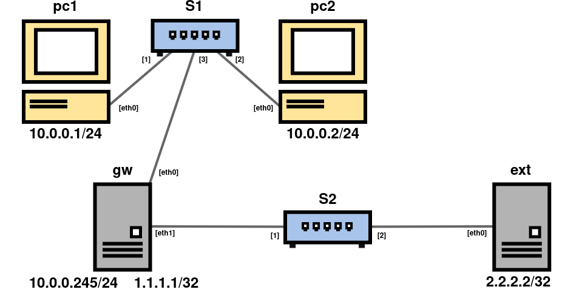

## 1. Obiettivo



Si vuole realizzare un meccanismo di traffic shaping tale da limitare la banda passate per operazioni di download specifiche. 
In particolare si vuole limitare il traffico per **pc1** che scarica file da **ext**. 
Si assume di avere controllo solo sulla **rete locale**, quindi non si possono inserire politiche di traffic shaping su **ext**.

---

## 2. Verifica del Funzionamento
#### Creazione file di test
Sul nodo **ext** creare il file con il comando:

```bash
dd if=/dev/urandom of=file.bin bs=1M count=1
```


#### Server per il download
Predisporre **ext** come server di download:

```bash
"cat file.bin" | nc -l -p 8080 -q1
```

Invece, sul lato del nodo pc1 o pc2, si può usare questo comando:

```bash
time sh -c "nc 2.2.2.2 8080 > /dev/null"
```

---

## 3. Soluzione tramite damper
#### Setup dei nodi su Kathara
Fare riferimento ai file del repository.

#### File damper.conf
Modificare il file **/etc/damper/damper.conf** nel nodo **gw**, per rispettare i parametri dell'esercizio.

```conf
# nfqueue queue id
queue 3

# traffic limit in bits per second (suffixes K and M allowed)
limit 10M

# queue length
packets 100
```

In questo modo avremo un **rate** di 10Mbits/s verso **pc1**, quindi più lento rispetto agli altri nodi.

#### Iptables
Prima di avviare l'istanza di damper, bisogna creare un regola sulle **iptables**, specifica per il traffico verso **pc1**:

```bash
iptables -t raw -A OUTPUT -d 10.0.0.1 -j NFQUEUE --queue-num 3 --queue-bypass
```

In modo da catturare tutto il traffico in uscita e assegnarlo alla nfequeue numero 3.

#### Istanza damper
Per finire, sarà necessario avviare l'istanza di damper con il comando:

```bash
damper /etc/damper/damper.conf &
```

Per far partire lo shaper.

---


